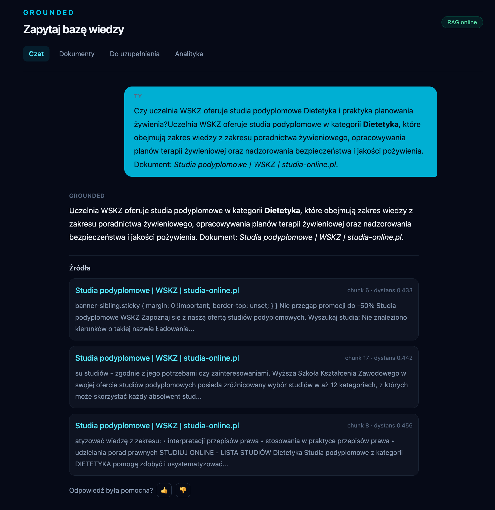

# Grounded

A FAQ assistant that answers questions from a set of uploaded documents and cites the fragments it used, for anyone who wants to read a small, complete RAG implementation rather than use a finished product.

## Why This Exists

This is a learning project, built step by step to understand two things: how a Laravel application is put together (queues, jobs, Eloquent, streaming responses), and how retrieval-augmented generation actually works when nothing is hidden behind a framework. The stages are listed in `docs/PLAN.md`. It is not a product and has never run anywhere but a laptop.

The name comes from *grounding*: an answer is tied to a source, and when the knowledge base has nothing close enough, the assistant says so instead of inventing one.

## How It Works

```
                                     ┌──────────────────────────┐
  upload / URL / API ──▶ documents ──│ ChunkDocument (Redis job) │
                                     └────────────┬─────────────┘
                                                  │ 500 chars, 50 overlap
                                                  ▼
                                          document_chunks
                                                  │ Ollama /api/embed (bge-m3)
                                                  ▼
                                      embedding vector(1024)  ──▶ PostgreSQL + pgvector
                                                                        │
  question ──▶ embed ──▶ ORDER BY embedding <=> question ASC LIMIT n ◀───┘
                              │
                              ▼
                   is the closest distance ≤ RAG_MAX_DISTANCE ?
                       │                                │
                    no │                                │ yes
                       ▼                                ▼
          "Nie znalazłem…" + status              chunks become the prompt context
           needs_review, no sources              ──▶ Ollama /api/generate (qwen3:8b)
                                                 ──▶ answer streamed over SSE + sources
```

A document is split into 500-character chunks with a 50-character overlap, each chunk is embedded, and the vector is stored in a `vector(1024)` column. A question is embedded the same way, and pgvector's `<=>` operator ranks chunks by cosine distance.

### Why it answers "I don't know"

An embedding search always returns its *n* closest chunks, even when the knowledge base contains nothing on the subject — "closest" is not "relevant". So the distance of the **nearest** chunk is compared against `RAG_MAX_DISTANCE`. Above the threshold, the question is treated as uncovered: the assistant returns a fixed message, records the question with status `needs_review`, and sends no sources to the model at all, so there is nothing for it to embroider on.

The threshold applies only to the closest chunk. Once a question counts as covered, every retrieved chunk stays in the context and in the source list — filtering each one separately would silently shrink the context and produce answers built on a fragment of the evidence.

The default of `0.54` was measured, not guessed. `bge-m3` packs its distances into a narrow band, so the number has to come from the corpus: in this repository's documents, questions the documents answer land between **0.39 and 0.52**, while off-topic questions (bread starter, football, capital cities) land between **0.58 and 0.64**. The default sits in that gap. A different embedding model, or a corpus covering more ground, shifts both bands — measure with `GET /api/search`, which returns distances without generating an answer.

## Screenshot



The chat view after a question. The answer is followed by the chunks it was built from — each
one links back to its document and shows its cosine distance, so it is visible how close the
retrieval actually was.

The knowledge base here was built by importing public pages from a university website
(`studia-online.pl`) as a demo corpus; the project is not affiliated with it. The first chunk
also shows a limitation described below: text imported from a web page still carries leftover
CSS, because extraction is not structure-aware.

## Tech Stack

| Choice | Reason |
|---|---|
| Laravel 12 (PHP 8.4) | The framework being learned; queues, jobs and streamed responses come with it. |
| PostgreSQL + pgvector | Keeps vectors next to the documents they belong to, so one database and one `JOIN` answer "which document did this chunk come from" — no separate vector store to sync. |
| Redis queue + worker | Embedding a document means one HTTP call per chunk and takes far longer than a web request may; the upload returns immediately and the job reports progress through `indexing_status`. |
| Ollama, running locally | No API keys, no per-token cost and no documents leaving the machine, which matters when the corpus is private; the price is that answers are as fast as the laptop. |
| React + TypeScript (no router) | Four pages selected by pathname; enough for the interface, and the types make the API responses explicit. |
| Symfony DomCrawler | Extracts readable text from an imported web page without a headless browser. |

## Quick Start

Requirements: Docker (with Compose) and [Ollama](https://ollama.com) on the host. No PHP, Composer or Node installation is needed — the commands below run them in containers.

```bash
# 1. Models. bge-m3 is multilingual and matches the vector(1024) column;
#    qwen3:8b writes the answers.
ollama pull bge-m3
ollama pull qwen3:8b

# 2. Configuration.
cp .env.example .env
```

Then edit `.env` and point the application at the host's Ollama, because inside a container `localhost` is the container itself:

```
OLLAMA_URL=http://host.docker.internal:11434
```

```bash
# 3. Directories Laravel needs at runtime but git does not track.
mkdir -p storage/framework/cache/data storage/framework/sessions storage/framework/views bootstrap/cache

# 4. PHP dependencies (the application image has no Composer).
docker run --rm -v "$PWD":/app -w /app composer:2 install

# 5. Frontend assets. Without them the pages return 500 — Vite has no manifest.
docker run --rm -v "$PWD":/app -w /app node:22 sh -c "npm install && npm run build && npm run build:widget"

# 6. Start the stack, set the key, create the schema.
docker compose up -d
docker compose exec app php artisan key:generate
docker compose exec app php artisan migrate

# 7. The worker started before the tables existed and has already given up.
docker compose restart worker
```

The interface is at `http://localhost:8000`. First question, end to end:

```bash
curl -X POST http://localhost:8000/api/documents/import \
  -F "title=ETF basics" -F "file=@notes.md"

# Indexing runs in the background; wait for "completed".
curl http://localhost:8000/api/documents

curl -X POST http://localhost:8000/api/chat \
  -H "Content-Type: application/json" \
  -d '{"question":"What is tracking difference?","limit":2}'
```

Running the tests:

```bash
docker compose exec app php artisan test
```

## Usage

Every request and response below was executed against a running instance; responses are verbatim except where shortened with `…`. Ids and distances come from two different knowledge bases — one holding a single short English note, one holding that note plus a longer Polish document — so they differ between examples.

### Ask a question

```bash
curl -X POST http://localhost:8000/api/chat \
  -H "Content-Type: application/json" \
  -d '{"question":"What is tracking difference?","limit":2}'
```

```json
{
  "answer": "Tracking difference refers to the difference between the return of an ETF and the return of the index it is designed to track, such as the S&P 500. This concept is outlined in the document titled **ETF basics**.",
  "sources": [
    {
      "title": "ETF basics",
      "document_id": 1,
      "position": 0,
      "distance": 0.4754,
      "excerpt": "# ETF basics\n\nAn ETF (Exchange Traded Fund) is a fund traded…"
    }
  ]
}
```

Generation is not fast: on an M4 with `qwen3:8b`, this request took roughly 50 seconds.

### A question the documents do not cover

```bash
curl -X POST http://localhost:8000/api/chat \
  -H "Content-Type: application/json" \
  -d '{"question":"How do I bake sourdough bread?"}'
```

```json
{"answer":"Nie znalazłem wystarczająco podobnych informacji w bazie wiedzy.","sources":[]}
```

The message is hard-coded in Polish; see Limitations.

### Streaming

```bash
curl -N -X POST http://localhost:8000/api/chat/stream \
  -H "Content-Type: application/json" \
  -d '{"question":"What is a TER?","limit":1}'
```

```
data: {"type":"token","content":"TER"}

data: {"type":"token","content":" ("}

data: {"type":"token","content":"Total"}

…

data: {"type":"done","question_id":12,"sources":[{"title":"ETF-y w praktyce — notatka z webinaru","document_id":6,"position":14,"distance":0.4992499354183869,"excerpt":"…"}]}
```

Tokens arrive as they are generated; the final `done` event carries the sources and the id of the stored question, which is what the feedback endpoint expects.

### Search without generating an answer

Useful for seeing the distances the threshold acts on.

```bash
curl "http://localhost:8000/api/search?q=what%20is%20tracking%20difference&limit=2"
```

```json
[
  {"content":"…","position":18,"document_id":6,"title":"ETF-y w praktyce — notatka z webinaru","distance":0.5124},
  {"content":"# ETF basics\n\nAn ETF (Exchange Traded Fund)…","position":0,"document_id":8,"title":"ETF basics","distance":0.5231}
]
```

### Import a web page

```bash
curl -X POST http://localhost:8000/api/documents/import-url \
  -H "Content-Type: application/json" \
  -d '{"url":"https://example.com","title":"Example page"}'
```

```json
{
  "title": "Example page",
  "content": "Example DomainThis domain is for use in documentation examples without needing permission. Avoid use in operations.Learn more",
  "source_url": "https://example.com",
  "indexing_status": "queued",
  "id": 9
}
```

The text is taken from `<main>`, falling back to `<article>` and then `<body>`. As the output shows, block boundaries are not preserved — words from separate elements end up joined.

### Analytics

```bash
curl http://localhost:8000/api/analytics/questions
```

```json
{
  "summary": {"total":9,"answered":7,"needs_review":2,"resolved":0,
              "positive_ratings":0,"negative_ratings":0,"unrated":9},
  "most_asked": [{"question":"What is a TER?","count":2},
                 {"question":"czym jest etf?","count":2}],
  "similar_groups": [{"count":2,"questions":[{"id":11,"question":"What is a TER?"}, …]}],
  "needs_review": [{"id":10,"question":"…","status":"needs_review", …}]
}
```

`similar_groups` clusters questions that mean the same thing by comparing question embeddings — it requires PostgreSQL and returns `[]` on any other driver.

### Other endpoints

`GET /api/documents`, `POST /api/documents`, `PUT|PATCH /api/documents/{id}`, `DELETE /api/documents/{id}` (deleting a document removes its chunks), `POST /api/documents/{id}/chunk`, `GET /api/questions?status=needs_review`, `POST /api/questions/{id}/feedback`, `POST /api/questions/{id}/resolve`. The full contract is in `docs/openapi.yaml`.

### Embeddable widget

Any page can host the assistant with one line:

```html
<script src="http://localhost:8000/widget.js" data-title="Ask about ETFs" defer></script>
```

It is plain TypeScript in a shadow root (4.5 kB), not the React bundle, so it neither carries the application's styles nor inherits the host's. Optional attributes: `data-api`, `data-title`, `data-accent`. `/widget-demo` serves a page that is deliberately not the application, to see it in place.

## Configuration

The variables that matter, from `.env.example`:

| Variable | Default | Meaning |
|---|---|---|
| `OLLAMA_URL` | `http://host.docker.internal:11434` | Ollama's address as seen from the application container. Use `http://localhost:11434` only when PHP also runs on the host. |
| `REDIS_QUEUE_RETRY_AFTER` | `180` | Seconds before Redis re-delivers a job. Must stay above the worker `--timeout` (120). |
| `OLLAMA_EMBEDDING_MODEL` | `bge-m3` | Model used for both document chunks and questions. Its output dimension must match the `vector(1024)` column. |
| `OLLAMA_CHAT_MODEL` | `qwen3:8b` | Model that writes the answer from the retrieved context. |
| `RAG_MAX_DISTANCE` | `0.54` | Cosine distance above which the closest chunk counts as irrelevant and the assistant declines to answer. Model-specific. |
| `RAG_QUESTION_SIMILARITY` | `0.8` | Cosine similarity at which two questions are grouped as asking the same thing in the analytics view. Not present in `.env.example`; read from the environment with this default. |
| `DB_*`, `POSTGRES_*` | `grounded` | Database credentials. Both sets exist because Laravel reads one and the Postgres image reads the other from the same file. |
| `QUEUE_CONNECTION` | `redis` | Indexing runs through the queue. Setting this to `sync` makes uploads block until embedding finishes. |

### Changing `.env`

`docker-compose.yml` passes `.env` to the containers with `env_file`, which copies the values
into the container environment **when the container is created**. Editing `.env` afterwards
changes nothing in a running stack, and the mounted file does not win either: Laravel's dotenv
loader does not override variables that already exist in the real environment. Apply changes with

```bash
docker compose up -d --force-recreate app worker
```

## Choosing Models

The embedding model decides which chunks the question reaches; the chat model only phrases what it is handed. A chat model cannot recover information that retrieval never fetched, so an upgrade there polishes the wording while the same upgrade on the embedding side changes which documents are found at all. This is why `bge-m3` is the default: it is multilingual, and an English-trained model such as `all-MiniLM-L6-v2` retrieves poorly from Polish documents regardless of what writes the answer.

Changing the embedding model means re-indexing everything. Vectors from different models are not comparable, so a mixed table produces distances that mean nothing, and `RAG_MAX_DISTANCE` — calibrated per model — stops matching reality. The dimension is also fixed in the schema: `document_chunks.embedding` is `vector(1024)` because that is `bge-m3`'s output, and a model with a different width needs a migration before it can store anything. Worth testing two or three models on your own documents before the knowledge base grows.

## Limitations

What is simplified or missing, stated plainly:

- **Chunking is character-based.** Fixed 500-character windows with a 50-character overlap, applied to the raw text. Sentences, paragraphs, headings and code blocks are all cut mid-stride, and a chunk may begin in the middle of a word. Nothing adapts to document structure.
- **No vector index.** There is no HNSW or IVFFlat index on the embedding column, so every search is a sequential scan over all chunks. Fine for hundreds of chunks, not for hundreds of thousands.
- **No authentication.** Every API route is public, including the ones that create and delete documents. CORS allows any origin on `/api/*` — required for the widget, and far too open for a real deployment.
- **`GET /api/documents` returns the full text of every document.** No pagination, no API Resources; the response grows with the corpus.
- **CI does not run the tests.** `.github/workflows/php.yml` validates `composer.json` and installs dependencies; the test step is commented out.
- **Mixed languages.** The interface and the "I don't know" message are Polish, the code and prompts are English. The prompt does not ask the model to answer in the question's language, so the language of an answer depends on the model and the retrieved context.
- **PDF extraction is text-only.** `smalot/pdfparser` reads the text layer; scanned documents without one produce empty content, and there is no OCR.
- **Retrieval is purely semantic.** No keyword or hybrid search, so exact identifiers, product codes and rare proper nouns are found only if the embedding happens to place them nearby.
- **No reranking**, no query rewriting, no conversation memory — each question is answered on its own.

## Roadmap

Not implemented. Ideas, in rough order of usefulness, kept here so the list above stays honest:

- Hybrid search: PostgreSQL full-text combined with vector search, then reranking.
- Quality tests in CI: a fixed set of questions with expected sources, run when chunking or the model changes.
- Structure-aware chunking that respects paragraph and heading boundaries.
- An Ollama/OpenAI switch per knowledge base.
- Handoff to a human: when the assistant does not know, send the question on by mail or webhook.
- Multiple separate knowledge bases.

## License

MIT.
